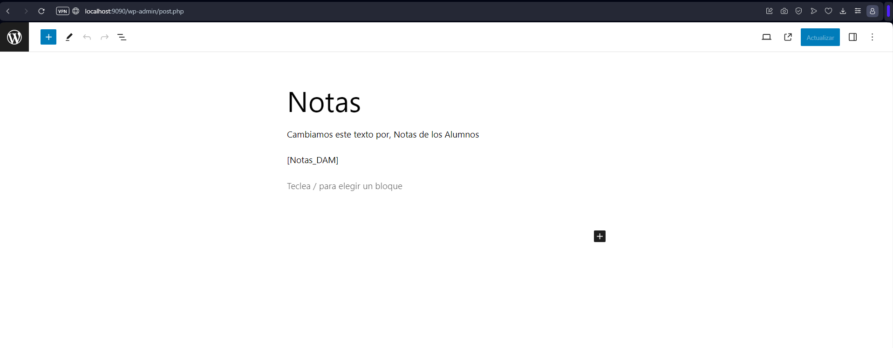
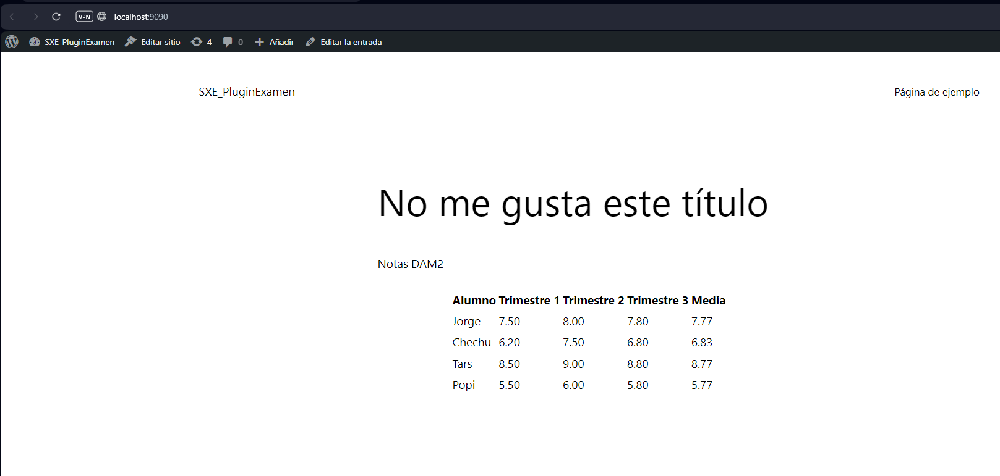

# Examen SXE Plugin

##  1. Introducción

En este examen se nos ha pedido que nos inventemos un Plugin. En un primer momento se nos ha dado una hoja,
para que expliquemos y codifiquemos nuestro plugin en papel. Luego, se nos ha dicho que con la ayuda de
Internet intentemos ver que tal estaba lo que habíamos hecho en el papel. En mi caso me he dado cuenta que 
lo que había planteado sobre el papel se me hacía muy difícil llevarlo a la práctica, teniendo en cuenta el 
escaso tiempo que teníamos para hacerlo y los nervios del exámen, así que he decidido dejar esa idea principal
para un proyecto personal que haré más adelante. Por lo tanto, he decidido hacer un plugin que me permita recoger
las notas de los alumnos de DAM y que me calcule la nota media de cada uno de ellos.

## 2.Desarrollo

### 2.1. Creación del Docker-Compose
Podrás ver información sobre como crear un Docker-Compose en el siguiente enlace de mi GitHub: [Docker-Compose](https://github.com/cristianmoreiraa/WordPress)

### 2.2. Creación del Base de Datos
Teniendo en cuenta los datos que nos han dado en el examen, he creado una base de datos llamada `db` con una tabla llamada `wp_notas` que es la siguiente:


     
     En este caso tomamos como ejemplo 4 alumnos y sus notas se ponen de manera random.

### 2.3. Creación del Plugin
Para crear el plugin, he seguido los siguientes pasos:

1. Crear un archivo .php llamado `user-php` en la carpeta `wp-content/plugins/` con el siguiente código:

```php

   <?php
/**
 * @package Gestion de Notas
 * @version 1.0.7
 */
/*
Plugin Name: Gestion de Notas
Plugin URI: http://wordpress.org/plugins/gestion-notas/
Description: Plugin para gestionar las notas de los alumnos en tres trimestres.
Author: CristianMoreira
Version: 1.1.0
Author URI: http://tu-sitio-web.com/
*/

// Función para crear la tabla de notas en la base de datos
function crearTablaNotas() {
    global $wpdb;
    $table_name = $wpdb->prefix . 'notas';

    $charset_collate = $wpdb->get_charset_collate();

    $sql = "CREATE TABLE IF NOT EXISTS $table_name (
        id mediumint(9) NOT NULL AUTO_INCREMENT,
        alumno varchar(255) NOT NULL,
        trimestre_1 decimal(4,2) NOT NULL,
        trimestre_2 decimal(4,2) NOT NULL,
        trimestre_3 decimal(4,2) NOT NULL,
        media decimal(4,2) NOT NULL,
        PRIMARY KEY  (id)
    ) $charset_collate;";

    require_once(ABSPATH . 'wp-admin/includes/upgrade.php');
    dbDelta($sql);
}

// Función para insertar datos de ejemplo o proporcionados desde fuera
function insertarDatos($datos) {
    global $wpdb;
    $table_name = $wpdb->prefix . 'notas';

    foreach ($datos as $dato) {
        $wpdb->insert($table_name, $dato);
    }
}

// Función para calcular la media de las notas
function calcularMedia($trimestre_1, $trimestre_2, $trimestre_3) {
    return number_format((float)(($trimestre_1 + $trimestre_2 + $trimestre_3) / 3), 2, '.', '');
}

// Función para actualizar las medias en la base de datos
function actualizarMedias() {
    global $wpdb;
    $table_name = $wpdb->prefix . 'notas';

    $alumnos = $wpdb->get_results("SELECT * FROM $table_name");

    foreach ($alumnos as $alumno) {
        $media = calcularMedia($alumno->trimestre_1, $alumno->trimestre_2, $alumno->trimestre_3);

        $wpdb->update(
            $table_name,
            array('media' => $media),
            array('id' => $alumno->id)
        );
    }
}

// Función para mostrar las notas utilizando un shortcode
function mostrarNotasShortcode($atts) {
    ob_start();
    mostrarNotas();
    return ob_get_clean();
}

// Función para mostrar las notas
function mostrarNotas() {
    global $wpdb;
    $table_name = $wpdb->prefix . 'notas';

    $alumnos = $wpdb->get_results("SELECT * FROM $table_name");

    echo '<table class="wp-list-table widefat fixed striped">';
    echo '<thead><tr><th>Alumno</th><th>Trimestre 1</th><th>Trimestre 2</th><th>Trimestre 3</th><th>Media</th></tr></thead><tbody>';

    foreach ($alumnos as $alumno) {
        echo '<tr>';
        echo '<td>' . $alumno->alumno . '</td>';
        echo '<td>' . $alumno->trimestre_1 . '</td>';
        echo '<td>' . $alumno->trimestre_2 . '</td>';
        echo '<td>' . $alumno->trimestre_3 . '</td>';
        echo '<td>' . $alumno->media . '</td>';
        echo '</tr>';
    }

    echo '</tbody></table>';
}

// Acción de activación del plugin
register_activation_hook(__FILE__, 'crearTablaNotas');

// Acción para permitir la inserción de datos desde fuera
if (isset($_GET['insertar_notas'])) {
    $datos_personalizados = array(
        array('alumno' => 'Jorge', 'trimestre_1' => 7.5, 'trimestre_2' => 8.0, 'trimestre_3' => 7.8),
        array('alumno' => 'Chechu', 'trimestre_1' => 6.2, 'trimestre_2' => 7.5, 'trimestre_3' => 6.8),
        array('alumno' => 'Marcos', 'trimestre_1' => 8.5, 'trimestre_2' => 9.0, 'trimestre_3' => 8.8),
        array('alumno' => 'Popi', 'trimestre_1' => 5.5, 'trimestre_2' => 6.0, 'trimestre_3' => 5.8),
    );

    insertarDatos($datos_personalizados);
    actualizarMedias();
}

// Registrar el shortcode
add_shortcode('Notas_DAM', 'mostrarNotasShortcode');

function mostrar_datos_title($title) {
    return 'No me gusta este título';
}
add_filter('the_title', 'mostrar_datos_title');

function cambiar_contenido($content) {
    // Reemplazar la frase específica en el contenido
    $content = str_replace('Cambiamos este texto por, Notas de los Alumnos', 'Notas DAM2', $content);
    return $content;
}

add_filter('the_content', 'cambiar_contenido');


```

### 2.3.1 Explicación del código

1. Aquí tenemos el `the_content` que nos permite cambiar el contenido de la página.

```php
function cambiar_contenido($content) {
    // Reemplazar la frase específica en el contenido
    $content = str_replace('Cambiamos este texto por, Notas de los Alumnos', 'Notas DAM2', $content);
    return $content;
}

add_filter('the_content', 'cambiar_contenido');
```

2. Aquí tenemos el `the_title` que nos permite cambiar el título de la página.

```php
function mostrar_datos_title($title) {
    return 'No me gusta este título';
}
add_filter('the_title', 'mostrar_datos_title');
```

# 3. Resultado

**Así se verá nuestra página sin que funcione el Plugin**




**Así se verá nuestra página una vez esté funcionando el Plugin**





### Autor: Cristian Moreira Alén