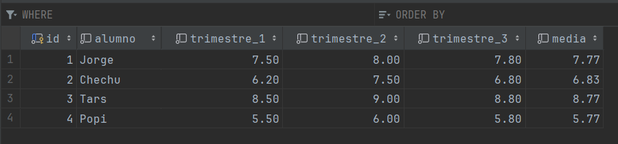

# Examen SXE Plugin

##  1. Introducción

En este examen se nos ha pedido que nos inventemos un Plugin. En un primer momento se nos ha dado una hoja,
para que expliquemos y codifiquemos nuestro plugin en papel. Luego, se nos ha dicho que con la ayuda de
Internet intentemos ver que tal estaba lo que habíamos hecho en el papel. En mi caso me he dado cuenta que 
lo que había planteado sobre el papel se me hacía muy difícil llevarlo a la práctica, teniendo en cuenta el 
escaso tiempo que teníamos para hacerlo y los nervios del exámen, así que he decidido dejar esa idea principal
para un proyecto personal que haré más adelante. Por lo tanto, he decidido hacer un plugin que me permita recoger
las notas de los alumnos de DAM y que me calcule la nota media de cada uno de ellos.

## 2.Desarrollo

### 2.1. Creación del Docker-Compose
Podrás ver información sobre como crear un Docker-Compose en el siguiente enlace de mi GitHub: [Docker-Compose](https://github.com/cristianmoreiraa/WordPress)

### 2.2. Creación del Base de Datos
Teniendo en cuenta los datos que nos han dado en el examen, he creado una base de datos llamada `db` con una tabla llamada `wp_notas` que es la siguiente:

     En este caso tomamos como ejemplo 4 alumnos y sus notas se ponen de manera random.